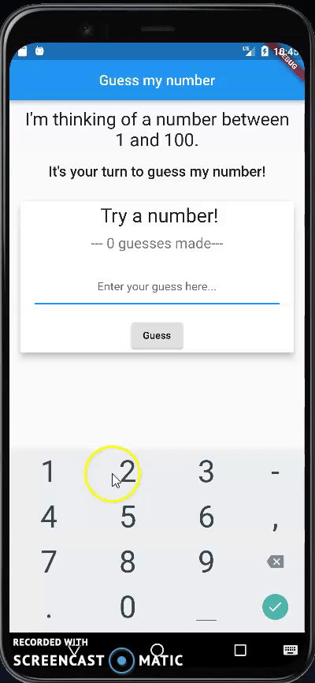

### Guess The Number Flutter Game

##### In this short game, you have to guess the right number between 1 and 100.
##### In order to do so, you will need to enter a value in the TextField and press on the "Guess" button. Then, the game will tell you whether your guess is right or you need to pick a bigger or a smaller number.
##### Also, at each point in time you will be able to see how many attempts you have already made since the start of the game.
##### After guessing right, you will be prompted with an AllertWindow and you can choose whether to restart the game and to play again or not. If you chose to not restart the game, the TextField will become unavaliable. 
##### If you decide to restart the game later you can press on "Reset" button and you will be able to play again.
